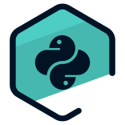
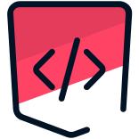

# Matheus Camargo (aka Rhogar Darkmor) 👨‍💻

**Desenvolvedor em Formação | Graduando em Sistemas de Informação**  
*Em transição de carreira para desenvolvimento de software*

---

## 🚀 Sobre Mim

Desenvolvedor em formação com foco em **Back-end** usando Python e Java. Atualmente estudando **Sistemas de Informação** e buscando minha primeira oportunidade na área de tecnologia.

- 🎯 **Objetivo:** Desenvolvedor Back-end Jr/Estágio
- 📚 **Estudando:** Python, Java, HTML, CSS, JavaScript
- 🌱 **Crescendo:** Desde 2018 aprendendo programação
- ⚡ **Diferencial:** Experiência anterior em análise de dados

---

## 🛠️ Stack Tecnológica

---

## 📊 GitHub Stats

---

## 📚 Certificações

### 🎯 Lógica de Programação

  
  
  
  

### 🐍 Python

  
  
  
  
  
  
  

### 🌐 Frontend & Tools

  
  
  
  
  

---

## 🌟 Projeto em Destaque

### 🐉 Drakkar - Proxy Viewer & Stream Simulator

**Tecnologias:** Python | Selenium | Web Scraping | Multi-threading  
**Features:** Validação de proxies, simulação realista, interface gráfica

---

## 🎯 Objetivo Atual

> **Buscando primeira oportunidade como Desenvolvedor Jr/Estágio**  
> *Foco em desenvolvimento Back-end com Python ou Java*

*"A persistência é o caminho do êxito." - Charles Chaplin*

