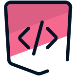

# Matheus Camargo
## Software Developer | Computer Information Systems Student

**Aspiring Backend Developer | 7+ Years Programming Journey**  
*Leveraging analytical expertise to deliver robust software solutions*

---

## Professional Summary

Results-driven software development student with comprehensive experience in **Python** and **Java** ecosystems. Combining analytical background with modern programming practices to create efficient, scalable solutions. Seeking junior developer position to contribute technical expertise while continuing professional growth.

**Core Competencies:**
• Backend Development (Python, Java) • Object-Oriented Programming • API Integration  
• Database Management • Version Control (Git) • Test-Driven Development

---

## Technical Stack

**Programming Languages**  

**Frontend Technologies**  

**Development Tools & Databases**  

---

## GitHub Analytics

---

## Professional Development

**Completed Certifications (16 courses)**

| **Programming Fundamentals** | **Python Specialization** | **Web Development & Tools** |
|:---:|:---:|:---:|
|   |   |   |
|   |   |   |
| |   |  |
| |  | |

---

## Featured Project

### Drakkar - Enterprise Proxy Management System

**Architecture:** Python-based automation framework  
**Key Features:** Multi-threaded processing, real-time validation, enterprise-grade logging  
**Technologies:** `Python` `Selenium WebDriver` `Threading` `GUI Development`

---

## Career Objective

**Seeking Junior Backend Developer Position**

*Committed to delivering high-quality code and contributing to team success through continuous learning and technical excellence. Available for immediate start.*

